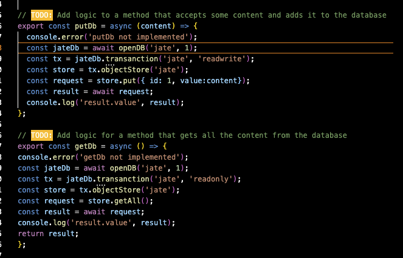

# textEditor

## Description
This project is a text editor that runs within the browser. This single page application uses IndexDB API to store data. Building this proect allowed me to further my understanding of PWAs.

## Heroku Link
https://ucb-texteditor.herokuapp.com/

## Code Snippet 

Logic:

Installation:
1[install](assets/install.png)

## Author
<a href="https://github.com/Mrwaynejames">GitHub</a>